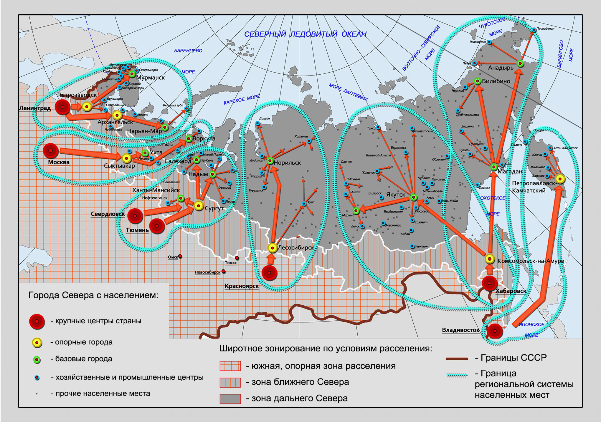

# Актуальные градостроительные принципы, исследования и разработки в проектировании и строительстве


Анализ градостроительных принципов, актуальных исследований и разработок в проектировании и строительстве поселений, энергоэффективных зданий в отечественной и зарубежной практике в Арктической зоне



Обзор программ, правительственных и субправительственных организаций. Рассмотреть аспекты при проектировании и строительстве поселений, энергоэффективности зданий


Масштабы арктических территорий по площади и рассмотренная бытовая специфика кочевничества, вахтового и исследовательского освоения, диктует подходы к рассмотрению и принятию решений по развитию территории в связке с федеральным, муниципальным и местным уровнем. Исходя из указанного, в этом разделе авторами рассмотрена градостроительная ситуация на уровне схем территориального планирования в целом и по специфике применения застройки многоквартирными домами на уровне планировки территории в арктических районах. При рассмотрении авторами принимались во внимание следующие аспекты:

1. Градостроительная доктрина — рассматривается общая риторика градостроительной политики и производные от неё механизмы принятия градостроительных решений на высших управленческих уровнях (муниципальном, субъекта, федеральном) территорией;
2. Методы регулирования — рассматриваются документы и акты, регулирующие процессы застройки территории, их влияние на процессы преобразования территории и на интересантов;
3. Характеристика жилых зон — характерные черты застройки, определяющие её типологическую принадлежность (тип застройки, домов и т.п.) и формы владения собственностью для жилой недвижимости;

Оценка потребности в застройке многоквартирными домами районных центрах РС(Я), находящихся на арктических территориях, производилась на основе данных, полученных в проведённых ранее исследованиях.

## Исходные концепции и подходы к расселению на территории Арктики

Формированию современных градостроительных принципов предшествовали предпосылки, обусловленные запросами решения социальных задач. Решения этих задач легли в основу направления преобразования арктических территорий Канады, России, США и частично — Финляндии и Норвегии.

Во второй половине 1960-х, наряду с концепциями группового размещения населенных мест в Арктике, было положено начало идеям использования вахтового метода при освоении новых районов Севера. Основной запрос формировался социально-экономическими задачами расселения, исходящими от нефтегазового комплекса Западной Сибири (Ямало-Ненецкого автономного округа): расселение персонала и их семей с целью переброски производственных сил ко вновь открытым месторождениям, располагающихся на существенном удалении от уже имевшихся центров промышленности и логистики. Исследованием вопроса и решением указанных задач занимались сотрудники ЛенНИИПградостроительства (Л. К. Панов, С. И. Крестьяшин и др.), ЛенЗНИИЭПа (Т. В. Римская-Корсакова, В. Л. Ружже и др.), а также коллектив московского ГИПРОГОРа. В этих исследованиях выделялось три принципиальных варианта расселения: первый предусматривал внешнее централизованное расселение, когда обслуживание газоносных районов происходило бы из базового города, расположенного за пределами зоны Севера, а вблизи зоны месторождений создавались лишь вахтовые поселки; второй вариант предполагал создание одного или двух базовых городов в пределах зоны освоения и сети вахтовых поселков; третий вариант – строился на основе размещения небольших базовых населенных пунктов и вахтовых поселков при каждой группе месторождений \[Фейгина, Э. Я. Районные планировки нефтегазоносных районов Тюменской области]. При разработке концепции расселения Ямало-Ненецкого автономного округа, был выбран второй вариант – так называемого «внутреннего централизованного» расселения. Он предусматривал возведение одного большого города до 80 тыс. жителей в пределах округа для всех групп месторождений как места проживания семей газовиков и нефтяников, а персонал доставлялся на работу в вахтовый поселок при месторождении на 2-3 недели, после чего вновь возвращался в базовый город на период отдыха. Наличие крупного базового города позиционировалось как предпосылка для организации обучения и повышения квалификации, места удовлетворения культурно-бытовых потребностей и ценностно-идеологического воздействия на человека (контроль персонала, пропаганда здорового образа жизни и др. релевантных задачам государства ценностей), а также возможна организация трудоустройства вторых членов семьи \[Фейгина, Э. Я. Районные планировки нефтегазоносных районов Тюменской области] {Варианты формирования вахтового расселения в северных регионах страны (графика разработана Благодетелевой О.М.)}. Такая модель расселения впоследствии стала называться «базовый город – вахтовый метод».

<figure><figcaption>
Варианты формирования вахтового расселения в северных регионах страны (графика разработана Благодетелевой О.М.)
</figcaption></figure>

Идеи, которые находят применения в промышленном освоении Арктических территорий, сформировались при разработке Генеральной схемы расселения СССР 1975 года, выполнявшейся в ЦНИИПградостроительства при участии коллективов ряда других институтов. Одним из положений Генеральной схемы расселения стала концепция формирования в зоне Севера так называемых «интерзональных» систем, основанных на взаимодействии вахтового типа расселения с опорными городами, расположенными в регионах с более мягким климатом \[]: в южных зонах на территориях развитых населённых пунктов, размещаемых вдоль имеющегося транспортного каркаса, формируются крупные опорные центры, далее — размещаются "базовые города", а уже на их основе формируются временные вахтовые населённые пункты с миграцией персонала {Пространственное формирование интерзональных зон Генеральной схемы расселения СССР 1975 года (графика разработана Благодетелевой О.М.)}.

Этот подход имел частичную жизнеспособность, поскольку логистические особенности региона накладывали ограничения в части сезонности поставки материалов, сырья, оборудования, а также сказывались на переброске персонала в некоторые арктические регионы с неадаптированным для транспорта ландшафтом. На момент исследования он актуален как для промышленности, так и для традиционного хозяйствования лишь в части принципиальной схемы взаимодействия интересантов: на уровне схем территориального планирования арктических регионов как в России, так и за её пределами, прослеживается именно этот подход к работе с территориями с экстремальными условиями для проживания людей.

<figure><figcaption>
Пространственное формирование интерзональных зон Генеральной схемы расселения СССР 1975 года (графика разработана Благодетелевой О.М.)
</figcaption></figure>

В части типологии и организации застройки многоквартирными домами на территории Республики Саха интерзональный подход претерпел незначительные изменения. Изменения подхода, прежде всего, связаны с новыми социально-экономическими запросами на формирование комфортной жилой среды в экстремальных условиях и, в частности, в Арктических районах Якутии. Опорными центрами выступают Якутск, Мирный и Нерюнгри. Тикси и Черский являются обособленными в части логистики опорными центрами и портами по маршруту, пролегающему по Северному морскому пути, и такая транспортная изолированность понижает их статус до базовых городов в части физико-георгафического положения. Экономико-географическое положение, т.к. статус Северо-якутской опорной зоны, при этом, сохраняет для этих населённых пунктов позиционирование Опорными центрами развития Арктической зоны Республики Саха.

<figure><figcaption>
Состав Арктической зоны Республики Саха (Якутия) (графика разработана Благодетелевой О.М.)
</figcaption></figure>

## Подходы к преобразованию территории в Российской Федерации

Подходы к преобразованию рассматриваются авторами на примере нескольких арктических населённых пунктов, выполняющих роль опорных центров в региональной экономике и градостроительной политике и связанных с трансконтинентальными транспортными коридорами: п. Тикси и с. Оленёк.

### Градостроительная доктрина

На федеральном уровне акцент развития территории смещён в сторону освоения, завязанного на решении задач по обеспечению суверенитета и национальной безопасности. При этом выделяются измеримые социальные показатели (доля домашних хозяйств, имеющих широкополосный доступ к информационно-телекоммуникационной сети "Интернет", количество рабочих мест на новых предприятиях, ожидаемая продолжительность жизни при рождении в Арктической зоне и др.) для реализации на более низких уровнях принятия решений.

На уровне субъекта федерации в стратегии развития закладывается поддержка градообразующих отраслей, коммунальной инфраструктуры и транспорта.

На муниципальном уровне предусматривается поддержка местных предприятий.

### Методы регулирования

Основополагающие концепции для принятия решений исходят из федерального уровня управления и фиксируются в документах стратегического планирования.

Основания разработки нормативно-правовых актов устанавливают Указы Президента РФ или Приказы ведомств. На период проведения исследования принят Указ Президента РФ от 5 марта 2020 г. N 164 "Об Основах государственной политики Российской Федерации в Арктике на период до 2035 года". Согласно Указа, устанавливаются такие методы и механизмы регулирования, как:

1. издание нормативных правовых актов, регулирующих экономическую и иную деятельность в Арктической зоне Российской Федерации;
2. разработка и реализация стратегии развития Арктической зоны Российской Федерации и обеспечения национальной безопасности на период до 2035 года, стратегии развития арктического туризма в Российской Федерации;
3. приведение документов стратегического планирования, разработанных в рамках целеполагания, прогнозирования, планирования и программирования на уровне субъекта Российской Федерации, муниципального образования, а также отраслевых документов стратегического планирования в соответствие с настоящими Основами;
4. создание единой статистической и информационно-аналитической системы в целях осуществления мониторинга социально-экономического развития Арктической зоны Российской Федерации и управления ее социально-экономическим развитием.

На федеральном уровне существуют и дополнительно сформированы формализованные структуры, направленные на работу с арктическими территориям:

1. Министерство иностранных дел Российской Федерации;
2. Государственная комиссия по вопросам развития Арктики;
3. Министерство экономического развития России (Департамент развития межрегионального и приграничного сотрудничества);
4. Комитет по федеративному устройству, региональной политике, местному самоуправлению и делам Севера Совета Федерации Федерального Собрания Российской Федерации;
5. Совет по Арктике и Антарктике при Совете Федерации Федерального Собрания Российской Федерации;
6. Комитет по региональной политике и проблемам Севера и Дальнего Востока Государственной Думы ФС РФ;

На уровне субъекта Республики Саха (Якутия) авторами установлены следующие формализованные структуры и институции:

1. Координационный Арктический совет при Главе Республики Саха (Якутия);
2. Комитет по вопросам коренных малочисленных народов Севера и делам Арктики Государственного Собрания (Ил Тумэн) Республики Саха (Якутия);
3. Министерство экономики Республики Саха (Якутия) Государственный комитет Республики Саха (Якутия) по делам Арктики.

В соответствии с N 190-ФЗ "Градостроительный кодекс Российской Федерации" правовой основой развития территорий являются документы территориального планирования (Генеральные планы — в случае развития поселений и населённых пунктов), определяющие стратегию всей административно-территориальной единицы и функциональное назначение территории как класс функциональной зоны, и документы градостроительного зонирования (Правила землепользования и застройки), устанавливающие правовые возможности и обязанности застройщиков в форме градостроительных регламентов на предельно допустимые параметры застройки в соответствии с классом территориальной зоны.

### Характеристика жилых зон

## Подходы к преобразованию территории в Соединённых Штатах Америки

### Градостроительная доктрина

В США, штат Аляска, Alaska Housing Finance Corporation выступает в роли государственного институционального органа развития территории, ведающего базами знаний в строительной отрасли и координирующего финансовые операции. Аналогом подобной организации в Российской Федерации на период исследования выступает группа "ДОМ.РФ", аналогично состоящая из нескольких юридических лиц, решающих требуемые задачи в рамках реализации инвестиционно-строительных проектов и развития территорий.

### Методы регулирования

Среди прикладных исследований по технологиям строительства выделяются разработки Permafrost Technology Foundation (рус. Фонд многолетнемерзлотных технологий) и Alaska Housing Finance Corporation (рус. Финансовая корпорация индивидуального домостроения Аляски).

Ряд разработок авторами рекомендуется как основа для последующей разработки технических решений.

Shallow Frost-Protected Foundations (рус. Неглубокие морозостойкие фундаменты) для частного домостроения (автор — Paul Perreault).

### Характеристика жилых зон

## Подходы к преобразованию территории в Канаде

### Градостроительная риторика

В проектировании и строительстве прослеживаются **тенденции** на включение бытовых процессов в алгоритм принятия решений при формировании функционально-планировочной организации жилья и интеграцию опыта коренного населения в технологии строительства в Арктике.

Так, в проекте ARCTIC FOOD NETWORK (рус. Арктическая продовольственная сеть) [\[\]](../ref/bibliography\_extended/sci\_intAFNLateralOffice.md), в программу эксплуатации территории включаются сезонность добычи продовольственных ресурсов, на основе которой выстраивается градостроительное решение на уровне субъекта (уровень схем территориального планирования в терминологии актуального на период исследования российского законодательства[\[\]](../ref/bibliography\_simple\_core.md#gradostroitelnyi-kodeks-rossiiskoi-federacii-elektronnyi-resurs-prinyat-gos.-dumoi-22-dekabrya-2004)). Решение направлено на объединение молодого населения на основе традиционного образа жизни с современным переосмыслением, отраженного в рационе коренных жителей Северной Америки инуитов (отечественному читателю также известных, как "эскимосы"), связанным с промыслом.

<figure><figcaption>
<em>Календарь проекта, показывающий существующую и проектную сезонность традиционных продуктов питания (графика разработана Lateral Office)</em>
</figcaption></figure>

Традиционный рацион инуитов, который сосредоточен на охоте и рыболовстве, постепенно подвергается риску из-за притока пищевых продуктов, произведенных с Юга, что приводит к увеличению уровня ожирения и диабета. Воздействие такого рациона на здоровье усиливается на Севере из-за высокой стоимости доставки свежих продуктов и более здоровой пищи. Типичная продовольственная корзина в Нунавуте вдвое дороже аналогичной на Юге Канады, а уровень жизни и зарплаты часто ниже. Арктическая продовольственная сеть удовлетворяет острую потребность в региональной сети арктических ферм, морозильных камер, и узлах-стоянках. Сеть окружает большую часть бассейна Фокс в Нунавуте, Канада, ареал разнообразной дикой природы, вдоль побережья Баффиновой Земли и около 30 000 Нунавуммиут.

<figure><figcaption>
Узел модулей  с кабинами, кухнями и подземными морозильными камерами <em>(графика разработана Lateral Office)</em>
</figcaption></figure>

Сеть состоит из того, что разработчики из Lateral Office называют навесами, сетками и полюсами, которые относятся к набору уникально интегрированных элементов, объединяющих архитектуру, ландшафт и технологии. Проект сети - это распределённые узлы регионального сельского хозяйства, сезонных мест стоянки, центров передачи данных и станций экологического управления. В дополнение к обеспечению безопасной продовольственной и туристической сети, AFN стремится объединить новые технологии с традиционными практиками для поддержки развивающейся экономики 21-го века.

Таким образом, этот проект наиболее комплексно воплощает все традиционные подходы и адаптации к условиям Арктики, рассмотренные в предшествующем разделе и реализует эти подходы как на градостроительном уровне, так и в архитектурном проектировании и инженерных решениях. В этом проекте применяются также узлы примыкания, основанные на традиционных примыканиях в конструктивной схеме инуитского каноэ для промысла, что является примером **тенденции адаптивности инженерных решений** к пользователям, создание привычных, дружественных местному коренному населению, методов возведения и обслуживания.

### Методы регулирования&#x20;

### Характеристика жилых зон

## Подходы к преобразованию территории в Финляндии

Подходы к преобразованию рассматриваются авторами на примере арктического населённого пункта Oulu (рус. Оулу).

### Градостроительная доктрина

Большинство финнов живут в частных домах. Одним из основных преимуществ жилья, занимаемого владельцем, по сравнению с арендованным жильем является то, что часть расходов на жилье, например, взносы по ипотеке, может учитываться как сбережения. Однако покупка дома обычно влечет за собой получение кредита, что делает его существенным и долгосрочным. срочное экономическое обязательство, требующее тщательного рассмотрения.

Когда квартира свободна от долгов, расходы на жилье ниже, чем у человека, проживающего в съемной квартире. Кроме того, активы домовладельцев увеличиваются, если цены на квартиры растут. Риски включают снижение способности домохозяйства обслуживать кредит и снижение уровня цен на приобретаемое имущество.

Государство поддерживает жилье, занимаемое владельцами, гарантируя ипотечные кредиты и предоставляя субсидии на проценты при покупке жилья, занимаемого владельцами. Еще один способ, которым государство поддерживает собственника, — покупка занятого дома осуществляется за счет вычета части процентов по ипотечным кредитам.

Хеджирование Риски, связанные с ипотекой, можно уменьшить, адаптировав сумму и срок кредита на разумную сумму. Расходы на обслуживание кредита должны оставаться разумными по сравнению с предполагаемым уровнем дохода, чтобы у кредиторов были деньги и на другие аспекты их жизни. Ежемесячные расходы также могут быть увеличены, например, в случае значительных изменений уровня процентов.

### Методы регулирования&#x20;

### Характеристика жилых зон

Город предлагает широкий выбор недорогих вариантов жилья для местных жителей - собственное жилье, арендованное жилье и жилье с правом проживания как в многоэтажных домах, так и в частных домах.

Существует около 10 000 субсидируемых государством квартир для сдачи внаем и около 1 700 жилых помещений с правом проживания. Жилищные организации, владеющие арендным жильем, также предлагают не субсидируемые арендные квартиры. Крупнейшим арендодателем в городе Оулу является Sivakka-yhtymä Oy.

Типы жилья, доступные в Оулу, включают жилье, занимаемое владельцем, арендованное жилье, жилье с правом проживания и жилье с долевой собственностью.

Арендное жилье представлено как субсидированные государством арендные квартиры и арендные квартиры, финансируемые на открытом рынке. Жители субсидируемого государством жилья выбираются в соответствии с потребностями заявителя в жилье, доходом и финансовым достатком.

Sivakka (рус. Сивакка) является крупнейшим арендодателем и официальным поставщиком квартир в аренду в городе Оулу. Помимо Сивакки, есть много компаний, общины и частные лица, предлагающие съемное жилье. Другие субсидируемые государством арендодатели жилья в Оулу можно найти в Списке арендодателей жилья.

Жилье с правом проживания Жилье с правом проживания представляет собой смесь арендного жилья и жилья, занимаемого собственником. Вы можете жить в квартире с правом проживания после оплаты права на проживание. плата за проживание, которая составляет примерно 15 % от первоначальной покупной цены квартиры. Вы также будете платить ежемесячную плату за обслуживание, аналогичную аренде.

Для того, чтобы получить квартиру с правом проживания, нужен номер очереди. Получив номер, вы можете связаться с собственником квартиры с правом проживания, на получение которой вы хотите подать заявление. Жилье в собственности Выставленное на продажу собственное жилье можно искать на сайтах застройщиков и агентов по недвижимости, а также в других веб-сервисах.

Жилье для студентов и молодежи Жилье для студентов и молодежи в Оулу сдают в аренду PSOAS (Фонд студенческого жилья в Северной Финляндии), Otokylä и Osnakodit. Жилье для особых групп Город предлагает жилье людям, нуждающимся в особой помощи. Возможна также помощь в жилищном вопросе, например, по ведению домашнего хозяйства.

В центральных районах преобладает микрорайонная застройка с формированием комплексной инфраструктуры для целевого типа интересантов (студенты, наёмные работники, и др.). Основной фокус при формировании жилья смещён на создание комплексной инфраструктуры в черте плотной и компактной застройки. Точечно присутствует застройка сблокированными секциями домов.

На периферии в незначительной доле присутствует точечная застройка домами усадебного типа на выделенных участках.

## Подходы к преобразованию территории в Норвегии

Подходы к преобразованию рассматриваются авторами на примере арктического населённого пункта Tromsø (рус. Тромсё). Этот населённый пункт развивался исторически как опорный центр норвежской Арктики, формируясь как промысловая промышленная инфраструктура опорного центра норвежской Арктики норвежским вождём Ottar fra Hålogaland (рус. Охтер из Хологаланда) в период 890 г.г. н.э. \[[https://www.regjeringen.no/no/dokumenter/nou-2007-14/id584312/](https://www.regjeringen.no/no/dokumenter/nou-2007-14/id584312/)].

<figure><figcaption>
Панорамный вид Тромсё (фотография Svein-Magne Tunli)
</figcaption></figure>

### Градостроительная доктрина

Общинная (Коммуны являются вторым административным уровнем деления Норвегии после губерний  — фюльке) социальная часть плана определяет общие долгосрочные цели для сообщества Тромсё и муниципалитета Тромсё на двенадцатилетнюю перспективу и является стратегией для достижения этих целей.

На этом уровне применяется механизм соучаствующего проектирования, частью которого являются публичные информационные системы (географический портал, сайт администрации общины), использующиеся в публичных обсуждениях и на ранних этапах принятия решений. На раннем этапе производится консультация с интересантами территории (преимущественно, это жители и владельцы предприятий).

В ходе консультаций с обществом в целом были определены три всеобъемлющие цели:

* Тромсё должен быть климатически и экологически устойчивым обществом.
* Тромсё должен быть экономически устойчивым обществом.
* Тромсё должен быть социально устойчивым обществом.

Прочие ведомства и субъекты, находящиеся на уровнях принятия решений ниже общинного  следуют этим определённым целям при разработке локальных решений по застройке и нормативно-правовых актов.

### Методы регулирования&#x20;

Kommuneplanes являются документами территориального планирования муниципального уровня, состоящих из социальной и землеустроительной частей муниципального генерального плана.

Ресурс www.gatami.no является порталом-агрегатором принятия решений, с помощью которого любой интересант, включая жителей, может сообщать о проблемах и формировать запросы на развитие территории, а управленческая команда — получать оперативную информацию и проводить оперативную аналитику и реагирование на ситуации. Прикладные информационные технологии позволяют создавать формы для пользователей и унифицировать структуры поступающих данных без создания избыточных юридически формализованных форм стандартизации. В свою очередь, унифицированная структура позволяет произвести автоматизированную обработку методами статистики, создавать визуализацию данных для управленческих команд и, как итог, повышать качество обратной связи и оперативность в принятии решений.

Представляющие ценность исторические здания являются предметом охраны местного законодательства об объектах культурного наследия. Портал [https://tromso.gravearbeider.no/](https://tromso.gravearbeider.no/) на базе геоинформационной платформы позволяет отслеживать заявки на археологические исследования территории застройки.

### Характеристика жилых зон

В центральных районах преобладает микрорайонная застройка высотой 5-7 этажей. Основной фокус при формировании жилья смещён на городской тип: создание комплексной инфраструктуры в черте плотной и компактной застройки.

<figure><figcaption>
Смешанная застройка жилых и общественно-деловых зон центра Тромсё (Автор фотоснимка — Илья Варламов)
</figcaption></figure>

Микрорайонная застройка группируется по градостроительному положению — доступности, наличию смежных точек интереса пользователей и градостроительным ограничениям. Так, студенческие кластеры застраиваются общежитиями с сохранением пешеходной доступности.

<figure><figcaption>
Новая застройка студенческих общежитий (Автор фотоснимка — Илья Варламов)
</figcaption></figure>

В центре Тромсё и на побережье размещаются исторические здания, здесь сосредоточена наибольшая концентрация деревянных домов в Северной Норвегии, старейший из них построен в 1789 году. Предметом охраны являются фасады зданий, технология их возведения и конструктивные элементы, телефонные будки, опоры светильников, светильники и таблички. Заброшенные здания были подвержены реставрации на основе законодательных решений по охране культурного наследия. Таким образом были восстановлены здания рыболовецких промысловых складов в доках.

<figure><figcaption>
Историческая застройка центра Тромсё (Автор фотоснимка — Илья Варламов)
</figcaption></figure>

Современная застройка максимально ориентирована на пользователя: доступность для пешеходов, навигация, освещение, инфраструктура пешеходной мобильности, т.к. велостойки, представляют собой отражение вышеописанной градостроительной доктрины территории. По конструктивной схеме преобладают монолитно-каркасные дома.

<figure><figcaption>
Периметральная застройка микрорайонов каркасными домами (Автор фотоснимка — Илья Варламов)
</figcaption></figure>

<figure><figcaption>
Устройство пешеходных путей и дворовых территорий жилых домов (Автор фотоснимка — Илья Варламов)
</figcaption></figure>

<figure><figcaption>
Застройка прибрежных и водных территорий каркасными домами (Автор фотоснимка — Илья Варламов)
</figcaption></figure>

На периферии преобладают дома усадебного типа на выделенных участках.
