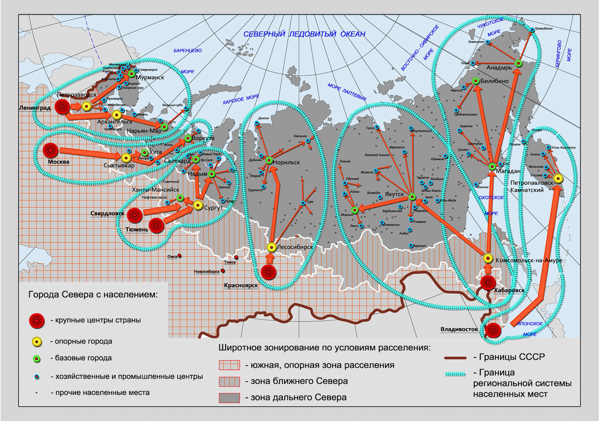

# Научное исследование 1

## Ключевые слова

## URL

## Реквизиты

| Параметр                       | Значение |
| ------------------------------ | -------- |
| Наименование исследования      |          |
| БГзаголовокАвтор               |          |
| БГобластьЗнания                |          |
| БГсведенияОбОтветственности    |          |
| БГобластьИздания               |          |
| БГнаселенныйПунктИздания       |          |
| БГиздательство                 |          |
| БГгодИздания                   |          |
| БГОбластьФизХарактеристики     |          |
| БГобластьСерии                 |          |
| Описание и роль в исследовании |          |

## Положения (ключевые для исследования)
